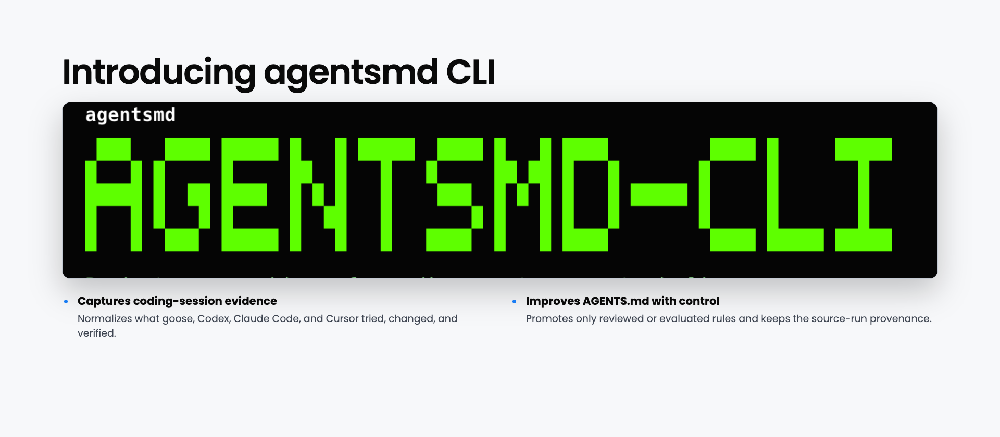
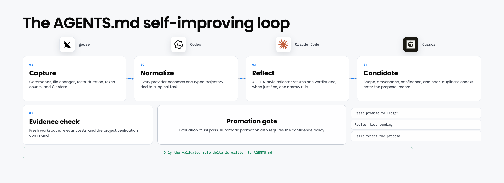

<div align="center">

# AGENTSMD CLI

### Let `AGENTS.md` learn from the work your coding agent just completed.

**Capture real coding sessions. Propose one narrow lesson. Validate it. Promote only what earns its place.**

agentsmd is a local-first CLI for authoring, versioning, measuring, and safely improving repository instructions—without fine-tuning, reinforcement learning, or coding-agent lock-in.

[](https://github.com/rudrakshkarpe/agentsmd-cli/actions/workflows/ci.yml)
[](go.mod)
[](LICENSE)

[Install](#install) · [Quick start](#quick-start) · [How it works](#how-it-works) · [Learning example](#a-real-learning-example) · [CLI reference](#cli) · [Safety](#safety-and-trust-model) · [Roadmap](#roadmap)

</div>



> [!IMPORTANT]
> **Active development.** Project detection, cross-CLI lifecycle capture, durable reflection queues, command-based evaluation gates, opt-in automatic promotion, and checksummed macOS/Linux releases work today. One reproducible held-out study is included; broader multi-task results and offline optimization remain in development.

## The problem

`AGENTS.md` tells coding agents how to work inside a repository: which commands to run, which boundaries to respect, and how to validate a change. The file is usually static, even though the repository and the agents working in it are not. Useful corrections stay trapped in session transcripts; stale rules survive; repeated explorations consume time and tokens.

agentsmd adds a controlled evidence loop around the file:

```text
run a task → capture its trajectory → reflect once at the task boundary
           → propose one rule → review and validate → promote → measure
```

The active file never changes merely because a model suggested something. Every learned rule begins as a pending proposal, carries its source run and logical task, and becomes active only after human review or a configured evaluation gate.

## What ships today

| Capability | What it provides |
|---|---|
| **Repository-aware setup** | Conservative project detection, useful `AGENTS.md` scaffolding, reusable templates, and diagnostics. |
| **Cross-CLI capture** | Project-local lifecycle integrations for goose, Codex, Claude Code, and Cursor. |
| **Provider-neutral evidence** | Normalized trajectories with Git state, changed files, duration, test outcome, model, tokens, and available commands. |
| **Logical task correlation** | Groups related sessions across providers, branches, and explicit project tasks without conflating unrelated work on `main`. |
| **Bounded reflection** | Reflects once at a task boundary and returns one narrow candidate—or an explicit no-change verdict. |
| **Durable automation** | Idempotent background reflection queue with conservative lock recovery through `agentsmd doctor --repair`. |
| **Controlled promotion** | Pending review, command-based evaluation, confidence policy, near-duplicate checks, and opt-in automatic promotion. |
| **Auditable instructions** | Structured rule ledger, typed versions, provenance, targeted rendering, history, diff, tags, blame, and revert. |
| **Local-first privacy** | Raw evidence stays local; configurable RE2 patterns redact only the copy sent to an external reflector. |
| **Reproducible evaluation** | Fresh-workspace before/after benchmarks, held-out verification, multi-task suites, and single-rule ablations. |

## The self-improving loop



This is repository-level learning, not model training. Future agents receive better context because the project retained a verified lesson; the underlying model weights remain unchanged.

## Coding-harness support

The write target is universal: every supported tool reads `AGENTS.md`. Capture stays provider-specific because each CLI records sessions differently; all adapters normalize into the same trajectory schema.

<table align="center" width="100%">
<tr>
<td align="center" width="25%">
<a href="https://github.com/block/goose"></a><br/>
<strong>goose</strong><br/>
<sub>Project hook plugin</sub>
</td>
<td align="center" width="25%">
<a href="https://github.com/openai/codex"></a><br/>
<strong>Codex CLI</strong><br/>
<sub>Project SessionEnd hook</sub>
</td>
<td align="center" width="25%">
<a href="https://claude.com/product/claude-code"></a><br/>
<strong>Claude Code</strong><br/>
<sub>Session hook + JSONL normalization</sub>
</td>
<td align="center" width="25%">
<a href="https://cursor.com"><picture><source media="(prefers-color-scheme: dark)" srcset="https://svgl.app/library/cursor_dark.svg"></picture></a><br/>
<strong>Cursor</strong><br/>
<sub>Project sessionEnd hook</sub>
</td>
</tr>
</table>

Each connector preserves existing provider settings. Session-end evidence is persisted immediately; transcript parsing, Git enrichment, reflection, and evaluation continue through a detached local worker.

## Install

### Shell installer (macOS and Linux)

```bash
curl -fsSL https://rudrakshkarpe.com/install.sh | sh
```

The installer selects Apple Silicon, Intel macOS, or Linux automatically, verifies the release archive's SHA-256 checksum, and installs to `~/.local/bin`. Choose another directory when needed:

```bash
curl -fsSL https://rudrakshkarpe.com/install.sh | \
  AGENTSMD_INSTALL_DIR=/usr/local/bin sh
```

Once installed from the shell release, update in place with the same checksum verification:

```bash
agentsmd update
```

Use `agentsmd update --check` to check without installing. `agentsmd upgrade` is an alias. Package-manager symlinks are deliberately not overwritten; update those installations through their package manager.

If GitHub's release CDN is slow on your route and Go is already installed, bypass the binary download:

```bash
GOBIN="$HOME/.local/bin" go install github.com/rudrakshkarpe/agentsmd-cli/cmd/agentsmd@latest
```

### Go install

Requirements: Go 1.23 or newer.

```bash
go install github.com/rudrakshkarpe/agentsmd-cli/cmd/agentsmd@latest
```

### Build from source

```bash
git clone https://github.com/rudrakshkarpe/agentsmd-cli.git
cd agentsmd-cli
go build -trimpath -o ./bin/agentsmd ./cmd/agentsmd
./bin/agentsmd --version
```

## Quick start

Let agentsmd inspect the repository and create a useful baseline:

```bash
cd your-project
agentsmd init
agentsmd doctor
```

Connect the coding tools you actually use. Each command installs a project-local end-of-session hook:

```bash
agentsmd connect codex
agentsmd connect claude
agentsmd connect cursor
agentsmd connect goose
```

Configure a reflector and the command that must pass before a proposal is eligible for automatic promotion:

```bash
agentsmd automate \
  --reflect-command "./scripts/reflect-agentsmd" \
  --evaluate-command "go test ./..."
```

This automatically reflects after capture but leaves successful proposals pending for review. Automatic promotion is an explicit additional policy:

```bash
agentsmd automate --auto-promote --min-confidence 0.90
```

`--auto-promote` is rejected unless both reflection and evaluation commands are configured. The evaluation command receives `AGENTSMD_PROPOSAL_ID`, `AGENTSMD_RULE`, and `AGENTSMD_RUN_ID` in its environment.

Raw trajectories remain in the local `.agentsmd` store. When the reflector is
an external program or service, configure repeatable RE2 patterns to scrub only
the copy sent to it:

```bash
agentsmd automate \
  --redact 'sk-[A-Za-z0-9_-]+' \
  --redact '[A-Za-z0-9._%+-]+@[A-Za-z0-9.-]+'
```

Redaction covers session and task identifiers, messages, tool arguments and
results, paths, diffs, commands, and metadata. It does not modify the locally
stored evidence. Use `--clear-redactions` to remove the configured patterns.

Captured sessions land in `.agentsmd/runs/`. Inspect their provider, outcome, duration, changed files, and test summary with:

```bash
agentsmd sessions
agentsmd sessions show <run-id>
```

`agentsmd doctor` also inspects the durable reflection queue. If a machine or
worker stopped while a job was marked as processing, recover it safely with:

```bash
agentsmd doctor --repair
```

Worker locks record their process, host, and start time. Repair removes only
locks older than the 15-minute processing window and requeues only processing
jobs that no longer have a lock. It leaves fresh locks and failed jobs intact.

Sessions on a feature branch are grouped automatically. For work that spans
branches or happens on `main`, set an explicit logical task and inspect its
before/after progress:

```bash
agentsmd task start "Fix parser regression" --id parser-regression
# Run one or more connected coding-agent sessions.
agentsmd progress parser-regression
agentsmd task end
```

Task identity precedence is provider task id, `AGENTSMD_TASK_ID`, explicit
project task, non-default Git branch, then a run-scoped fallback. The fallback
intentionally avoids combining unrelated sessions on `main`.

A reflector—or a person—can propose one targeted lesson, which stays pending until reviewed:

```bash
agentsmd learn \
  --task parser-regression \
  --run session-baseline \
  --rule "Run the focused parser fixture before the full suite."

agentsmd pending
agentsmd promote <proposal-id>
```

## A real learning example

The repository includes a six-session study around a concrete Go configuration bug. The starting `AGENTS.md` says only to make small changes, run focused tests, run the full suite, and format Go code.

```text
3 baseline sessions
  ├─ all solve the bug and pass the hidden tests
  ├─ all discover the Go cache is outside the sandbox only after testing
  └─ one explores a compatibility-only file outside the production call path
            ↓ reflect once per recorded run
2 targeted rules with run + task provenance
            ↓ evaluate in fresh workspaces
3 learned-guidance sessions pass the same hidden tests
```

The accepted rules tell the agent where the executed configuration path begins and how to keep the Go build cache inside the workspace. Compared with the baseline, the learned condition kept a 3/3 pass rate while median reported tokens moved from 90,724 to 54,274, median commands from 5 to 3, and median duration from 27.9 to 23.1 seconds.

This is evidence for one task and one two-rule bundle, not a general performance claim. Read the [task, raw trajectories, reflections, verifier, and limitations](benchmarks/config-precedence/README.md), or reproduce it with:

```bash
agentsmd benchmark \
  --spec benchmarks/config-precedence/spec.json \
  --trials 3 \
  --output benchmarks/config-precedence/results/my-run
```

The repository also includes a two-task suite and single-rule ablation runner:

```bash
agentsmd benchmark \
  --suite benchmarks/suite.json \
  --trials 3 \
  --output benchmarks/results/my-suite
```

For every task, the suite runs the baseline, the complete learned guidance,
and one condition with each declared learned rule removed. It writes a suite
report and fails the CLI regression gate if learned guidance reduces held-out
task success. The second task and runner are ready for reproducible trials;
multi-task model results are not checked in yet.

## How it works

### 1. Rules are structured data

Rules live in `.agentsmd/ledger.json`, with stable IDs, provenance, citation counts, and per-task token runs. Only the marker-delimited learned-rules block is generated; project setup, commands, and hand-written guidance are preserved.

### 2. Versions explain why a change exists

Every snapshot includes a typed reason (`manual`, `template`, or `learned`) and metadata such as the originating task, session, evaluation, and token delta.

### 3. Reflection happens at the task boundary

The reflector receives one normalized trajectory and returns exactly one of four verdicts:

- `missing_rule`
- `wrong_rule`
- `stale_rule`
- `not_an_agentsmd_problem`

The fourth verdict is deliberate: sometimes the correct improvement is no new instruction.

### 4. Suggestions are not trusted automatically

Learned changes enter `.agentsmd/pending/`. Promotion is a separate operation so humans or evaluation gates can reject weak, duplicated, overfitted, or costly rules.

## Benchmark method

The included runner treats instruction changes as an ablation: the prompt, fixture, agent configuration, number of trials, and verifier stay fixed; only `AGENTS.md` changes. Every trial starts in a fresh Git workspace. Held-out tests are copied in after the agent exits, preventing the agent from optimizing directly against the grader. Suite specs require at least two distinct tasks, and each declared rule is removed independently from the learned condition to measure its marginal contribution.

The case structure follows ideas from [Terminal-Bench](https://github.com/harbor-framework/terminal-bench) and [SWE-bench](https://github.com/SWE-bench/SWE-bench): a task, isolated environment, executable verifier, and auditable oracle. The learning side follows the reflective, incremental direction of [GEPA](https://arxiv.org/abs/2507.19457) and [ACE](https://arxiv.org/abs/2510.04618), while agentsmd adds a pending queue and explicit promotion gate around the resulting rules.

Each run preserves the raw event stream, normalized trajectory, solved workspace, verifier output, token usage, commands, and duration. Reports include the model and trial count. The suite-level regression gate protects task success, but broader claims still require recorded results across multiple models, agents, and repeated seeds.

## Automatic reflection

agentsmd can delegate reflection to any executable that reads a normalized trajectory as JSON on standard input and writes a verdict as JSON on standard output:

```bash
agentsmd learn \
  --trajectory .agentsmd/runs/session-123.json \
  --reflect-command "./my-reflector"
```

Expected output shape:

```json
{
  "verdict": "missing_rule",
  "rule": "Run the focused parser fixture before the full suite.",
  "confidence": 0.91,
  "origin": { "run": "session-123", "task": "parser-regression" },
  "rationale": "The session spent time debugging the wrong parser path."
}
```

This contract keeps model providers outside the core. Direct providers and a GEPA bridge can implement the same interface.

## CLI connections

`agentsmd connect` configures the supported tools without replacing their existing settings:

- Codex: `.codex/hooks.json`
- Claude Code: `.claude/settings.local.json`
- Cursor: `.cursor/hooks.json`
- goose: `.agents/plugins/agentsmd/`

All connectors capture start/end lifecycle events into a provider-neutral trajectory. The end event is persisted immediately, while Git evidence, transcript parsing, reflection, and evaluation run in a detached local worker. Runs record available start/end times, wall duration, Git revisions, worktree status, changed files, final diff, provider status, evaluation command, test outcome, model, and tokens. Claude Code additionally normalizes its JSONL transcript into assistant steps, tool calls, shell commands, and token usage. Codex transcript internals are intentionally not parsed because their documented format is unstable.

## CLI

| Goal | Command |
|---|---|
| Check for or install the latest release | `agentsmd update --check`, `agentsmd update` |
| Detect the project and create `AGENTS.md` | `agentsmd init` |
| Browse or apply reusable baselines | `agentsmd templates`, `agentsmd templates use NAME` |
| Connect a coding tool | `agentsmd connect codex\|claude\|cursor\|goose` |
| Configure automatic reflection and gating | `agentsmd automate` |
| Diagnose the local setup | `agentsmd doctor` |
| Inspect measured sessions | `agentsmd sessions`, `agentsmd sessions show RUN` |
| Correlate related sessions | `agentsmd task start LABEL`, `agentsmd task end` |
| Compare task progress | `agentsmd progress [TASK]` |
| Review the improvement queue | `agentsmd pending`, `agentsmd promote ID`, `agentsmd reject ID` |
| Propose a targeted rule | `agentsmd learn ...` |
| Compare static and learned guidance | `agentsmd benchmark --spec PATH` |

Legacy authoring, versioning, and measurement commands remain compatible but are hidden from the primary help while their UX is consolidated.

## Repository layout

```text
AGENTS.md                 rendered instructions read by coding agents
.agentsmd/
  config.yaml             project configuration
  connections.json        portable records of configured CLI hooks
  automation.json         reflection, evaluation, and promotion policy
  ledger.json             rules, provenance, citations, token runs
  versions/               typed snapshots, index, and tags
  pending/                proposed rules awaiting review
  runs/                   normalized trajectories and measurements
  sessions/               lifecycle baselines
  inbox/                  durable raw hook events
  queue/                  idempotent background reflection jobs
  evaluations/            gate results and command output
```

## Go library

The CLI is one consumer of reusable packages:

| Package | Responsibility |
|---|---|
| `schema` | Vendor-neutral trajectory, ledger, rule, proposal, and version types |
| `project` | Discovery, scaffolding, atomic persistence, and repository paths |
| `ledger` | Rule identity, deduplication, rendering, and linting |
| `version` | Typed snapshots, history, diff, tags, and revert |
| `capture` | Adapter interface for coding-agent session formats |
| `capture/claude` | Claude Code JSONL normalization |
| `detect` | Conservative stack and command discovery |
| `integration` | Project-local lifecycle hooks for supported coding tools |
| `session` | Lifecycle baselines plus Git, duration, file, and status evidence |
| `automation` | Durable reflection jobs, evaluation records, and gated promotion |
| `reflect` | Reflection verdict contract and command provider |
| `learning` | Propose, review, promote, reject, prune, and measure workflow |
| `benchmark` | Isolated before/after trials, held-out verification, artifacts, and reports |
| `cli` | Embeddable Cobra command tree |

`SPEC.md` is normative; Go packages should remain compatible with its schemas.

## Safety and trust model

- Local-first storage; no transcript upload is required by the core.
- Configurable RE2 redaction scrubs the copy passed to an external reflector while preserving local evidence.
- Queue recovery never removes a fresh worker lock or silently retries a completed or failed reflection.
- Learned rules never bypass the pending-review gate.
- Automatic promotion is disabled by default and cannot be enabled without an evaluation command.
- Whole-file reflective rewrites are avoided; learning produces targeted deltas.
- Version and proposal identifiers reject path traversal.
- CI tests Go 1.23 and 1.25 on Linux, macOS, and Windows and runs the race detector.
- Token savings are reported only from recorded runs of the same task.

## Roadmap

<details open>
<summary><strong>Available today</strong></summary>

- [x] Go library and Cobra CLI
- [x] Repository detection, templates, and diagnostics
- [x] Authoring, typed versions, blame, revert, and structured rule ledger
- [x] Pending-rule review with promote and reject decisions
- [x] Provider-neutral task-boundary reflector with an explicit no-change verdict
- [x] Codex, Claude Code, Cursor, and goose lifecycle connectors
- [x] Claude Code JSONL trajectory normalization
- [x] Logical-task identity and before/after progress comparisons
- [x] Git, changed-file, duration, model, token, and evaluation evidence capture
- [x] Idempotent background reflection queue and conservative recovery
- [x] Opt-in automatic promotion behind evaluation and confidence gates
- [x] Single-task and multi-task held-out benchmark runners
- [x] Single-rule ablations, reproducible reports, and token-usage evidence
- [x] Checksummed macOS and Linux release archives with a shell installer

</details>

<details>
<summary><strong>In progress</strong></summary>

- [ ] Rich transcript normalization for providers beyond Claude Code
- [ ] Watch daemon with session-staleness detection
- [ ] Offline GEPA optimization bridge

</details>

<details>
<summary><strong>Distribution next</strong></summary>

- [ ] Signed release artifacts
- [ ] Homebrew installation

</details>

See the [development roadmap](ROADMAP.md), [implementation plan](docs/COMMIT-ROADMAP.md), and [presentation deck](presentation/README.md).

## Development

```bash
make bootstrap
make check
```

Read [DEVELOPMENT.md](DEVELOPMENT.md) and [CONTRIBUTING.md](CONTRIBUTING.md) before opening a pull request. `main` is protected and changes land through green CI.

## License

Apache License 2.0.
